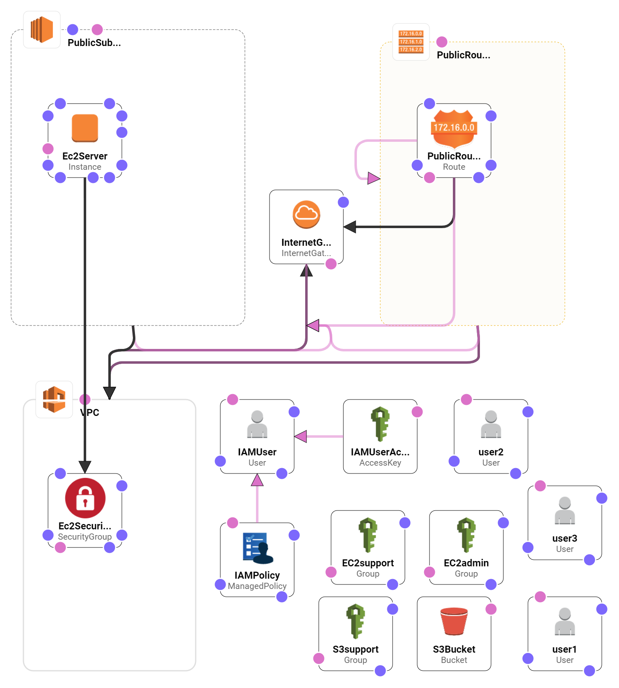

# Introduction to AWS Identity and Access Management IAM LAB

## Stack Details

## AWS Identity and Access Management (IAM)

AWS Identity and Access Management (IAM) is a web service that lets you securely control access to AWS resources for users. People (AWS resources that are available using the IAM authentication) and use its resources and how they can be used. With the help of IAM you can Share access to the AWS Account, Granular permissions, Security access AWS resources for applications running on Amazon EC2, Credentials works, Credentials for ensuring, Eventual Consistency.

## What kinds of security credentials can IAM users have?

- IAM users can have any combination of credentials that AWS supports, such as an AWS access key, X.509 certificate, SSH key, password for web app logins, or an MFA device.
- This allows users to interact with AWS in any manner that makes sense for them.

## What are the features of IAM roles for EC2 instances?

- IAM roles for EC2 instances provides the following features:
  - AWS temporary security credentials to use when making requests from running EC2 instances to AWS services.
  - Automatic rotation of the AWS temporary security credentials.
  - Granular AWS service permissions for applications running on EC2 instances

## IAM best Practises

- Some of the best practises to be followed during IAM are mentoned below:

  - Lock Away Your AWS Account Root User Access Keys
  - Create Individual IAM Users
  - Use AWS Defined Policies to Assign Permissions Whenever Possible
  - Use Groups to Assign Permissions to IAM Users
  - Grant Least Privilege
  - Use Access Levels to Review IAM Permissions
  - Configure a Strong Password Policy for Your Users
  - Enable MFA for Privileged Users
  - Use Roles for Applications That Run on Amazon EC2 Instances
  - Delegate by Using Roles Instead of by Sharing Credentials
  - Rotate Credentials Regularly
  - Remove Unnecessary Credentials
  - Use Policy Conditions for Extra Security
  - Monitor Activity in Your AWS Account

### Resources

- [Introduction to AWS Identity and Access Management (IAM)](https://vishnu2017nmit.wordpress.com/2017/07/31/lab1-introduction-to-aws-identity-and-access-management-iam/)
